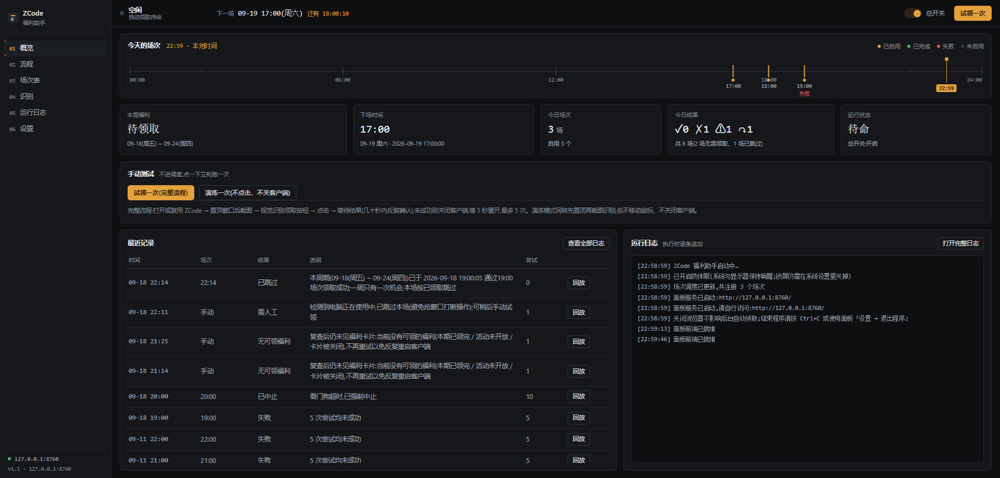
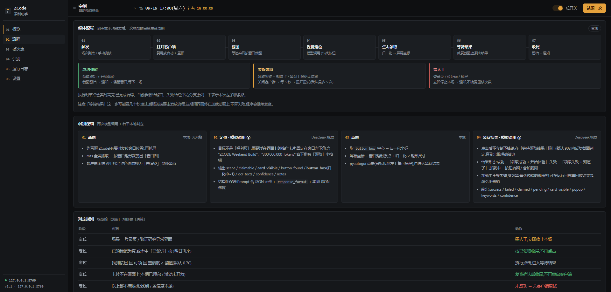
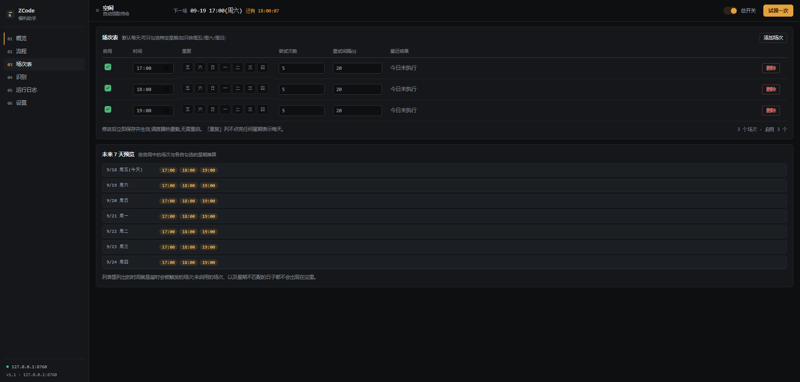
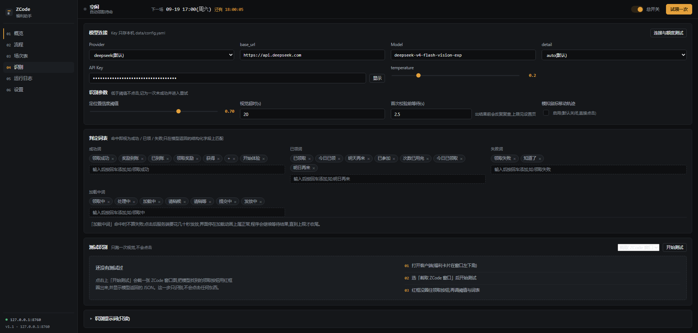
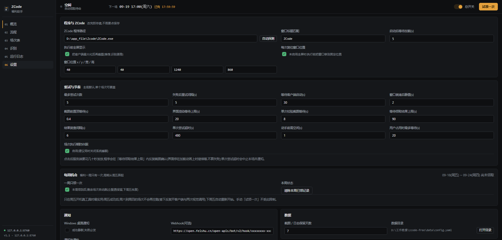
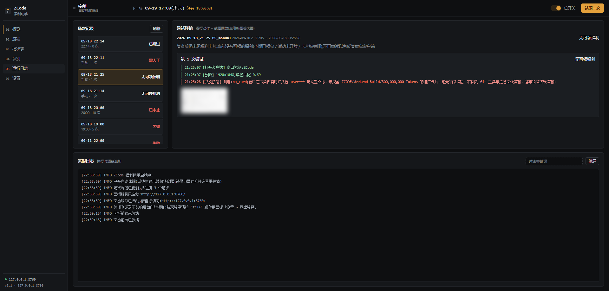

<div align="center">

<h1>ZCode 福利自动领取助手</h1>

<p><b>到点自动领取 ZCode 每日福利</b><br>
打开客户端 → 截图 → 视觉模型定位「领取」按钮 → 模拟点击 → 等待结果、反复确认<br>
失败自动关闭客户端、5 秒后重开，最多重试 5 次；配套一个浏览器里的本地控制面板</p>

<p>


</p>

<p>
<a href="#界面预览">界面预览</a> ·
<a href="#两种形态">两种形态</a> ·
<a href="#打包版">打包版</a> ·
<a href="#源码版">源码版</a> ·
<a href="#首次配置">首次配置</a> ·
<a href="#工作原理">工作原理</a> ·
<a href="#常见问题">常见问题</a>
</p>

</div>

---

## 这是什么

一个只在**本机**运行的 Windows 小工具：把「到点手动打开 ZCode 客户端、点一下领取」这件事交给程序按时完成。

| 能力 | 说明 |
|---|---|
| **定时触发** | 场次可指定星期（如只排周五/周六/周日），也可留空表示每天；修改后立即生效，无需重启 |
| **每周一次** | 福利一周只有一次机会（周期从周五算起）：本周领到后，剩余场次自动跳过，配置保留、下周五自动恢复 |
| **视觉定位** | 不写死按钮坐标：截图交给 DeepSeek 视觉模型，返回归一化坐标后再换算点击 |
| **结果等待** | 点击后不立刻下结论：服务端要几十秒发放，期间反复截图确认，界面停在加载动画上不算失败 |
| **失败重试** | 失败弹窗或界面无变化 → 关闭客户端 → 等待 5 秒 → 重开重试，默认最多 5 次 |
| **本地面板** | 纯静态前端 + 本地 HTTP 服务，浏览器里看状态、配场次、回放截图，离线可用 |
| **通知** | Windows 桌面通知 + Webhook（支持飞书 / 企业微信 / Server 酱），面板内可一键测连通 |
| **安全护栏** | 锁屏检测、用户占用保护、单实例互斥、防休眠、残留任务自愈，见[工作原理](#工作原理) |

> 面板与调度全部在本机运行；仅「识别」这一步会把客户端窗口截图发送给 DeepSeek 视觉模型，其余数据不出本机。

---

## 界面预览

深色「静默方格」界面，六个页面覆盖配置、监控与排障全流程。图片可点击放大。

<p align="center">
  
  
</p>
<p align="center">
  <sub><b>01 概览</b> — 今日场次时间轴 / 手动试领 / 最近记录　·　<b>02 流程</b> — 一次领取的完整生命周期与判定规则</sub>
</p>

<p align="center">
  
  
</p>
<p align="center">
  <sub><b>03 场次表</b> — 场次（可指定星期）与未来 7 天预览　·　<b>04 识别</b> — 模型连接、判定词表与「测试识别」</sub>
</p>

<p align="center">
  
  
</p>
<p align="center">
  <sub><b>05 运行日志</b> — 场次记录、逐次尝试详情与截图回放　·　<b>06 设置</b> — 客户端路径、重试节奏、通知与数据</sub>
</p>

---

## 两种形态

同一份代码，两种用法。**普通使用选打包版，改代码或排查问题选源码版。**

| | 打包版 | 源码版 |
|---|---|---|
| **适合谁** | 只想按时领福利，不碰代码 | 想改提示词、调参数、看代码 |
| **前置条件** | 无（不装 Python） | Python 3.14 |
| **启动方式** | 双击 `ZCodeAssistant.exe` | 双击 `run.bat`（或 `python main.py`） |
| **体积** | 约 42 MB（文件夹） | 约 85 MB（虚拟环境） |
| **附带工具** | 随包《使用说明.txt》 | 自检 / 环境侦察 / 演练模式齐全 |
| **获取方式** | `build.bat` 自行打包 | 克隆仓库即可 |

两种形态行为完全一致，数据目录结构也一致，配置可以互相搬运。

---

## 打包版

开箱即用的独立程序，目标机器**无需安装 Python 和任何依赖**。

### 使用

```
dist/ZCodeAssistant/
├─ ZCodeAssistant.exe    ← 双击运行
├─ _internal/            依赖与前端资源
└─ 使用说明.txt          随包分发的精简说明
```

1. 双击 `ZCodeAssistant.exe`，程序会自动用默认浏览器打开面板；
2. 面板里完成[首次配置](#首次配置)，打开顶栏总开关即可。

关闭浏览器不影响后台自动领取。结束程序用面板「设置 → 退出程序」（它没有控制台窗口，Ctrl+C 不适用）。

> **整个文件夹一起复制才能搬走**（onedir 打包，单独拿 exe 无法运行）。

### 自己打包

```bat
build.bat
```

脚本依次完成：检查虚拟环境 → 安装 PyInstaller 6.22.2 → 生成图标 → 跑自检（**必须全过**）→ 打包到 `dist\ZCodeAssistant\`。

打包配置见 `build.spec`，几条关键约定：

- 只带 `ui/index.html` + `ui/assets/`，排除 `ui/demos/`（设计原型与截图，约 4.6 MB，面板不引用）；
- **`data/` 绝不进包** —— 里面是 API Key 明文与屏幕截图；
- `pythoncom` / `win32com` 是函数内延迟导入，静态分析看不到，必须写进 `hiddenimports`，否则「自动探测 ZCode 路径」会静默失效；
- 关闭 UPX 压缩、不带控制台窗口，减少杀软误报。

### 分发注意

程序没有代码签名，且会模拟鼠标点击，可能触发安全软件提示：

- 首次运行弹「Windows 已保护你的电脑」→ 点「更多信息 → 仍要运行」；
- 杀软报可疑 → 把 `ZCodeAssistant.exe` 加入信任 / 白名单。

请只从可信来源获取本程序。

---

## 源码版

### 首次准备

```bat
:: 在项目根目录执行(已装好可跳过)
python -m venv .venv
.venv\Scripts\python.exe -m pip install -r requirements.txt
```

开发环境为 Python 3.14.4；更低版本未实测。

### 四个入口，双击即用

| 双击 | 作用 |
|---|---|
| `run.bat` | 启动面板，按场次常驻自动领取 |
| `dry-run.bat` | **演练模式**：截图、识别、走流程，但不点击、不关闭客户端 |
| `selftest.bat` | 环境自检（31 项，无需 API Key，约 15 秒，打包前必跑） |
| `probe.bat` | 环境侦察：定位 `ZCode.exe` 并截一张当前客户端图 |

### 命令行参数

```bat
run.bat                      :: 启动服务并打开浏览器面板
run.bat --dry-run            :: 演练模式(不点击、不关客户端)
run.bat --run-now            :: 启动后立即试领一次
run.bat --no-open            :: 只启动服务,不自动打开浏览器
run.bat --headless           :: 不启动 Web 服务,仅按场次调度
run.bat --port 9000          :: 换一个面板端口(默认 8760)
```

也可以不用 `.bat`，直接 `.venv\Scripts\python.exe main.py <参数>`。

> **`.bat` 必须保持纯 ASCII**：cmd.exe 按系统代码页解析批处理文件，把中文写进 `.bat` 在中文 Windows 下会导致整段乱码、命令全部失效。要改提示语请用英文，或另存为 ANSI 编码 —— 中文文档看 README 就好。

---

## 首次配置

面板里四步，全程鼠标操作：

**1. 设置页 —— 告诉程序客户端在哪**
点「自动探测」找到 `ZCode.exe`；探测不到就手动填完整路径。窗口标题匹配默认 `ZCode` 即可。

**2. 识别页 —— 配好视觉模型**
填入 DeepSeek API Key（[platform.deepseek.com](https://platform.deepseek.com) 创建，需小额余额），
点「连接与额度测试」验证连通与额度；再点「测试识别」，看模型能否用红框框出领取按钮。
框错了通常是左下角那张推广卡片当时不在画面上，或提示词需要微调。

**3. 场次表页 —— 排好时间**
添加时间场次（如 `10:00` / `16:00`）。点「重复」列的星期按钮可以只排特定星期——
例如只在周五六日跑，就点亮五/六/日；不点则每天都跑。修改即刻生效，调度器热重载，无需重启。

**4. 顶栏总开关 —— 打开**
之后到点自动执行。

> **建议先演练**：概览页点「演练一次（不点击、不关客户端）」跑一遍完整识别，
> 确认能稳定框到按钮，再点「试领一次（完整流程）」。

---

## 工作原理

```
 场次到点 / 手动触发
        │
        ▼
 本周已经领到过? ── 是 ──► 记录「已跳过」,不碰客户端、不调模型(配置保留,下周五恢复)
        │
        否
        ▼
 打开或复用 ZCode 客户端 ──► 最大化 + 置前
        │
        ▼
 等待界面渲染完成 ──► mss 截全屏 ──► 裁出窗口区域
        │
        ▼
 DeepSeek 视觉模型定位左下角推广卡片里的「领取」按钮(输出归一化坐标)
        │
        ▼
 置信度 ≥ 阈值(默认 0.70)?
        │
   是 ──┴──► 换算屏幕坐标 ──► 模拟点击
                                 │
                                 ▼
                    在「等待领取结果上限」(默认 90s)内反复截图判定
                                 │
              成功 ──► 记下"本周已领" ──► 截图留档 + 通知 ✅
                                 │
              失败 ──► 关闭客户端 → 等 5s → 重开重试
                          (最多 5 次,仍失败则记录并等下一场)
```

### 每周只有一次机会

福利**一周只能领一次**，周期从**周五**算起（周五 00:00 到下一个周五 00:00）。

所以一天里配的多个场次其实是"候选时间点"：其中一场领到之后，同一周期里剩下的场次再跑也变不出福利，
程序会直接记为「已跳过」——**不打开客户端、不调视觉模型**，只留一条记录。配置保持不动，下周五自动重新开始。

这样安排的好处是：只在周五开机跑工具时，领到之后周六到周四的场次不会空跑（每个空场次原本要白开一次
客户端、截两张图、调两次视觉 API）。

- **手动「试领一次」不受限制**——你主动要求就该执行，跳过只会让人困惑；
- **演练不算数**——否则一次演练就把本周期真机会"用掉"了；
- 状态存在 `data/weekly.json`，面板「设置 → 每周机会」可查看周期与状态，也能「清除本周已领记录」
  （比如你已经在别处手动领过了，想让工具照常执行）；
- 想完全不启用这套限制，把「一周只领一次」关掉即可，每个场次都会照常执行。

> **为什么以周五为界**：这套工具的实际用法是周五开会时打开。以周五为起点，周五当天领到后，
> 后面几天的场次自动静默跳过；到下周五又是新的一周，无需手动重置。

### 场次按星期

每个场次可以只排在指定星期。在场次表「重复」列点星期按钮即可：

| 按钮状态 | 含义 |
|---|---|
| 全部灰底（7 个都不高亮） | **每天**都跑（默认，与旧配置一致） |
| 部分高亮 | 只在**高亮的那些星期**跑（如只亮五六日 = 只在周五六日跑） |

比如实际只在周末用，就排 `周五 19:00`、`周六 19:00`、`周日 19:00`，周一至周四不会触发。
同一时间也可以排在不同星期（周五 19:00 与周六 19:00 是两条独立场次）。

「未来 7 天预览」会按各场次勾选的星期推算——不会出现的日子直接显示「无场次」；
顶栏与概览页的「下一场」也会带出日期与星期，避免把下周五的场次误看成今天。

> **为什么「等待结果」是单独一步**：点击后服务端要走一段发放流程（实测约 40 秒），这期间界面停在
> 加载动画上，既没有结果弹窗、也没有任何可匹配的文案。早期版本点击后只隔 2.5 秒截一张图就下结论，
> 于是每次都把"还在处理"误判成"没结果"，关掉客户端重试 —— 而重试会在同一处再失败一次，永远领不到。
> 现在改为在时限内反复复查，界面在加载中一律继续等，只有拿到明确结论（成功 / 失败 / 已领）才收尾。

### 判定规则

模型只负责「观察」，决策由本地规则做：

| 阶段 | 模型看到 | 本地判定 | 动作 |
|---|---|---|---|
| 触发 | 本周（周五起算）已经领到过 | 已跳过 | 不碰客户端、不调模型，只留一条记录 |
| 定位 | 登录页 / 验证码 / 锁屏 | 需人工 | 立即停止本场并通知，不浪费重试次数 |
| 定位 | 已领标记为真，或命中「已领取 / 今日已领 / 明天再来」等词 | 已领 | 按已领取收尾，不再点击 |
| 定位 | 找到按钮且置信度 ≥ 阈值 | 可点击 | 执行点击，进入等待结果 |
| 定位 | 福利卡片不在画面上 | 无可领 | 复查确认后收尾，**不再反复重启客户端** |
| 定位 | 找不到按钮或置信度不足 | 未成功 | 关客户端重试 |
| 等待 | 界面停在加载动画上，或命中「领取中 / 处理中」等词 | 加载中 | **继续等，不算失败** |
| 等待 | 弹窗含「领取成功 / 开始体验」等成功词 | 成功 | 记下本周已领 → 留档 + 通知 |
| 等待 | 弹窗含「领取失败 / 知道了」等失败词 | 未成功 | 关客户端重试 |
| 等待 | 点过之后卡片整张消失（也没有弹窗） | 已领 | 按已领取收尾，不重复点击 |
| 等待 | 等到上限仍无结论 | 未成功 | 关客户端重试 |

成功词、已领词、失败词、**加载中词**四张表都可以在识别页自行增删。

### 健壮性设计

<details>
<summary>点击展开：为避免误操作与误判做的十几件事</summary>

<br>

| 机制 | 解决的问题 |
|---|---|
| **场次按星期** | 只在周末用的工具不必把每天都排上场次，周一至周四不会白白触发 |
| **每周一次闸门** | 福利一周只有一次：本周领到后剩余场次静默跳过，不再白开客户端、白调两次视觉 API |
| **单实例互斥锁** | 双击两次会跑两个调度器，同一场领取两次并互抢前台 —— 第二个实例直接拒绝启动 |
| **防休眠**（`SetThreadExecutionState`） | 系统睡了调度器会跟着挂起，到点根本不触发；连显示器一起保活，否则截到黑图 |
| **锁屏检测** | 用系统 API 判断，屏幕黑 ≠ 锁屏；真的锁屏时跳过本场并通知，不等同于「加载中」 |
| **加载期纯色等待** | 客户端刚启动时画面是纯色，默认最多等 20 秒、期间反复置顶，不误判为失败 |
| **结果等待轮询** | 点击后几十秒才出结果，期间反复截图判定；加载中不算失败，见[工作原理](#工作原理) |
| **卡片缺失收敛** | 福利卡片整个不在画面上时（当期已领完/活动未开放），复查后直接收尾，不再空转 10 轮重试、反复强杀客户端 |
| **看门狗按次重置** | 超时上限按「每次尝试」计时，而不是给整场设总预算 —— 配了 10 次尝试的长场次不会跑到一半被腰斩 |
| **用户占用保护** | 检测到你在用键鼠时不抢前台、不点击，最多等 20 秒后放弃本场 |
| **修饰键保护** | 置前失败不会把 ALT 卡在按下态（那里会导致整台机器键鼠输入错乱），启动时兜底清理 |
| **窗口进程校验** | 拒绝同名无关窗口，不误关受保护进程 |
| **残留任务自愈** | 断电 / 强杀后遗留的 `running` 会话，启动时自动标记中止，状态不会一直转圈 |
| **通知失败可见** | webhook 推送失败会写明原因（面板「发送测试通知」一键验），不再静默当成功 |
| **演练模式** | 全链路跑通但不点击、不关客户端，用于验证识别效果 |

</details>

---

## 目录结构

```
zcode-free/
├─ main.py                入口:参数解析 / 组件装配 / 单实例 / 防休眠
├─ selftest.py            自检 31 项(无需 API Key)
├─ probe.py               环境侦察:定位 ZCode.exe + 截一张当前客户端图
├─ run.bat  dry-run.bat   源码版启动器 / 演练模式启动器
├─ selftest.bat  probe.bat
├─ build.bat  build.spec  一键打包 / PyInstaller 配置
├─ build/                 图标生成、版本信息、随包使用说明
├─ core/                  后端
│   ├─ config.py          配置读写 + 冻结路径分流(源码 / 打包两套路径)
│   ├─ scheduler.py       APScheduler 场次调度(支持按星期),配置改动热重载
│   ├─ runner.py          执行状态机:尝试 / 重试 / 收敛为最终结果
│   ├─ capture.py         mss 截图与窗口裁剪
│   ├─ vision.py          DeepSeek 视觉客户端(定位 + 结果判定两次调用)
│   ├─ zcode_ctrl.py      窗口查找 / 置前 / 最大化 / 启动客户端
│   ├─ clicker.py         坐标换算与鼠标点击
│   ├─ validate.py        模型输出校验与判定规则
│   ├─ storage.py         会话留档、过期清理、残留自愈
│   ├─ api.py  server.py  面板 API 与本地 HTTP 服务(静态资源 + SSE 推送)
│   ├─ events.py  logging_setup.py  notify.py
│   ├─ weekly.py          每周一次机会:周五起算的周期与领取状态
│   ├─ awake.py           防休眠
│   └─ single_instance.py 单实例互斥
├─ ui/                    Web 面板(纯静态 HTML/CSS/JS,离线可用)
│   ├─ index.html
│   ├─ assets/            css / js / 本地 GSAP
│   └─ demos/             5 个设计方向原型与选型材料(不参与运行)
│       └─ _design/       设计期工具;readme-shots.mjs 生成 README 截图(带脱敏)
├─ data/                  运行时数据(不入版本库):config.yaml / weekly.json / logs/ / shots/
└─ image/                 README 截图
```

---

## 数据与隐私

数据都落在 `data/` 下，**保留 7 天**（可改）：

```
data/
├─ config.yaml   设置与 API Key(明文,请勿分享这个文件)
├─ weekly.json   本周期(周五起算)是否已领到,决定后续场次跳不跳
├─ logs/         运行日志,按天切分
└─ shots/        每次尝试的截图留档,可在日志页回放
```

- **源码版**：`data/` 在项目根目录；
- **打包版**：`data/` 在 exe 同级目录；若放在 `Program Files` 等无写权限的位置，会自动改存到 `%LOCALAPPDATA%\ZCode福利助手\data`。

数据流向只有两处：截图发送给 DeepSeek 视觉模型用于识别，以及可选的 Webhook 通知。`data/` 已在 `.gitignore` 内，不会进版本库，打包时也被显式排除。

### Webhook 通知

设置页填机器人 URL，点「发送测试通知」当场看结果（失败会写明原因，例如密钥无效）。

| 平台 | 地址形态 | 说明 |
|---|---|---|
| 飞书 / Lark | `https://open.feishu.cn/open-apis/bot/v2/hook/...` | 自动按飞书的 `msg_type` 格式发送；出错时飞书仍回 HTTP 200，程序会读响应体的 `code` 判断真实结果 |
| 企业微信机器人 | `https://qyapi.weixin.qq.com/cgi-bin/webhook/send?key=...` | 读响应体的 `errcode` |
| Server 酱 | `https://sctapi.ftqq.com/....send` | 通用 JSON 载荷 |

> 除了成功/失败通知，**「当期没有可领的福利」不发通知**（不是故障，避免打扰）。

> API Key 目前是明文存盘。介意的话可以在系统里改用环境变量，或干脆只在自己机器上使用。

---

## 常见问题

<details>
<summary><b>找不到 ZCode.exe</b></summary>

设置页手动填完整路径；或先手动打开一次客户端 —— 运行中的进程可以直接读出路径。
</details>

<details>
<summary><b>识别不准 / 点不到按钮</b></summary>

用识别页「测试识别」看红框位置。注意目标不是"福利页"，而是**浮在界面上的推广卡片**（固定在窗口左下角，
含 `ZCODE Weekend Build` / `300,000,000 Tokens`，右下角有「领取」小按钮）—— 它可能出现在任意页面上。
框偏了先确认卡片确实在画面上、执行时窗口在前台未被遮挡，再调提示词与置信度阈值。
</details>

<details>
<summary><b>点了「领取」但一直没结果 / 报未成功</b></summary>

点击后服务端要走几十秒发放流程，这期间界面停在加载动画上，属正常现象。程序默认会等 90 秒
（设置页「等待领取结果上限」），期间反复截图确认，不会提前判失败。

如果**每次都等到上限仍无结果**：确认客户端窗口在执行期间没被其它窗口遮住；到日志页回放
`attempt-N-after-*.png` 多张校验图，看界面当时究竟停在哪个状态；若确实一直转圈不结束，
可能是服务端较慢，可把上限调大（如 180 秒）。
</details>

<details>
<summary><b>场次显示「已跳过」是什么意思</b></summary>

福利一周只有一次机会（周期从周五算起），本周已经在某个场次领到了，所以这个场次没执行——
没开客户端、没调模型，只留了一条记录。配置保持不变，下周五自动恢复。

如果这次跳过不该发生（比如你已经在别处手动领过、或想让它照常试），到设置页「每周机会」
点「清除本周已领记录」；想彻底不启用，把「一周只领一次」关掉。
</details>

<details>
<summary><b>周几点算新的一周 / 为什么是周五</b></summary>

周期是**周五 00:00 到下一个周五 00:00**，也就是周五~周四为一周。选周五当起点是因为这套工具
的实际用法是周五开会时打开：当天领到之后，周六到周四的场次自动跳过，下周五自动开始新周期。

周四属于上一周、周五开启新的一周——所以「周四晚上领到」不会让「周五」被跳过。
</details>

<details>
<summary><b>场次显示「失败」，但那是几天前的记录</b></summary>

旧版本把该时间的**最近一次**历史记录挂在状态列上，与"今天跑没跑"无关，看起来像是刚刚又失败了。
现在只显示当天的记录，没跑过就显示「今日未执行」；概览页的时间轴同样只回填当天结果。
</details>

<details>
<summary><b>提示「无可领福利」是什么意思</b></summary>

检查时画面上找不到福利卡片（左下角那张推广卡）。此时程序会复查几次确认不是渲染延迟，然后直接收尾，
**不会**关掉客户端反复重试 —— 卡片不存在时重启客户端也变不出来。

常见原因：本期福利已经领过了、活动未开放、或卡片被手动关掉。如果确定卡片应该在，用识别页
「测试识别」看模型能否框到它，或到日志页回放当时的定位截图。
</details>

<details>
<summary><b>Webhook 没收到通知 / 怎么确认配对了</b></summary>

到设置页点「发送测试通知」，结果直接显示在按钮旁边：成功显示「webhook 推送成功」，
失败会写明原因（如「服务端拒绝:param invalid: incoming webhook access token invalid」）。

飞书机器人需要显式 `msg_type`，早期版本发的是通用 JSON，飞书会回 `19002 params error`；
更隐蔽的是飞书**出错也返回 HTTP 200**，旧代码只看状态码就当成推送成功了。现在会读响应体里的
`code` / `errcode` 判断真实结果。
</details>

<details>
<summary><b>锁屏 / 休眠导致失败</b></summary>

程序会阻止系统与显示器休眠，但**阻止不了锁屏** —— 锁屏是安全策略，不是电源策略。真的锁屏时该场次会被判为「需人工」并跳过（不会浪费重试次数）。建议：屏幕保护设为「无」，锁屏超时设为「从不」。如需「睡眠也能唤醒领取」，得改用 Windows 任务计划程序，属另一套方案。
</details>

<details>
<summary><b>总开关开着但不触发</b></summary>

检查场次是否勾选启用、系统时间是否正确、**「重复」列的星期是否包含今天**（只排周五六日的场次，周一自然不会触发）；
日志页有每次触发记录。
</details>

<details>
<summary><b>面板打不开</b></summary>

先用 `run.bat --no-open` 启动，再手动访问日志里打印的地址（默认 `8760`，被占用会自动顺延）。浏览器建议 Edge / Chrome。
</details>

<details>
<summary><b>不想要动画 / 想要浅色主题</b></summary>

地址后加参数即可：`http://127.0.0.1:8760/?motion=0`、`?theme=light`。系统开启「减少动态效果」时也会自动禁用动画。
</details>

<details>
<summary><b>双击 .bat 报「不是内部或外部命令」并伴随乱码</b></summary>

该 `.bat` 被保存成了 UTF-8 中文。项目自带的已改为纯 ASCII；自行编辑过的请另存为 ANSI 编码。
</details>

<details>
<summary><b>杀软拦截 pyautogui</b></summary>

把对应的可执行文件加入信任（源码版是 `.venv\Scripts\python.exe`，打包版是 `ZCodeAssistant.exe`），或先用演练模式验证非点击链路。
</details>

---

## 延伸文档

| 文档 | 内容 |
|---|---|
| [技术方案 v1](ZCode福利助手-技术方案v1.md) | 需求、架构、模块设计、状态机、配置结构 |
| [打包方案 v1.1](ZCode福利助手-打包方案v1.md) | 打包前置改动、spec 约定、验证清单、风险 |
| [UI 设计方案 v1](ZCode福利助手-UI设计方案v1.md) | 界面设计文档（前端已按「静默方格」重做，文档待同步） |
| [ui/demos/](ui/demos/README.md) | 5 个设计方向原型与选型对比材料 |

---

## 合规提醒

仅用于自动化**本人账号、本机**的福利领取，单场点击次数极少（≤ 5 次 + 结果确认）。
请遵守 ZCode 服务条款；若官方推出「一键领取」入口，或条款禁止此类自动化，请停用本工具。
